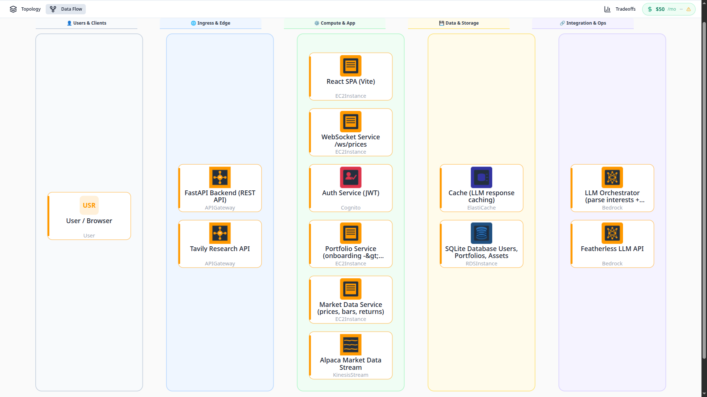

# Theme-Trader

> A personalized investment platform that builds an AI-generated stock portfolio based on your interests and risk tolerance.

Users complete a short onboarding form (hobbies, financial goals, risk appetite), and the platform uses a multi-step AI pipeline — powered by **Featherless LLM**, **Tavily research**, and **live Alpaca market data** — to recommend and rationalize a curated portfolio of stocks in real time.

---

## Project Structure

```
Theme-trader/
├── backend/        # FastAPI backend — AI pipeline, REST API, WebSocket, SQLite DB
│   └── README.md   # → Backend setup & startup guide
└── front_end/      # React + Vite frontend — Dashboard, Onboarding, real-time prices
    └── README.md   # → Frontend setup & startup guide
```

---

## Getting Started

This project has two independent services that must both be running:

### 1. Backend (FastAPI)
See **[`backend/README.md`](backend/README.md)** for the full guide.

```bash
cd backend
uv sync
uv run uvicorn app.main:app --reload
# Runs at http://127.0.0.1:8000
```

### 2. Frontend (React + Vite)
See **[`front_end/README.md`](front_end/README.md)** for the full guide.

```bash
cd front_end
npm install
npm run dev
# Runs at http://localhost:5173
```

---

## Tech Stack

| Layer | Technology |
|---|---|
| Frontend | React 19, Vite 8, React Router 7 |
| Backend | FastAPI, SQLAlchemy, SQLite |
| AI / LLM | Featherless API (OpenAI-compatible) |
| Research | Tavily Search API |
| Market Data | Alpaca WebSocket stream, yfinance |
| Package Manager | `uv` (Python), `npm` (Node) |

